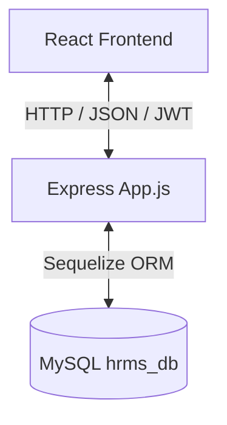

# HRMS Master Audit Report & Production-Ready Plan

This report provides a comprehensive audit of the Human Resource Management System (HRMS) codebase (both BackEnd and FrontEnd), evaluating the system's architecture, security posture, database design, API design, frontend integration, and code quality.

---

## Phase 1: Complete Project Understanding

The HRMS is structured as a decoupled client-server web application.

### 1. Architectural Layout
* **FrontEnd**: A single-page application built on Vite, React, TypeScript, and Tailwind CSS. It incorporates Radix UI components (styled via Shadcn templates) and Lucide React icons. Routing is simulated via local state switcher rather than standard browser routes.
* **BackEnd**: A Node.js Express server using Sequelize ORM to communicate with a MySQL database. It is structured into distinct layers: Config, Models, Middleware, Validations, Routes, Controllers, and Services.

### 2. Request Flow
1. **Trigger**: An action (e.g., loading employees, saving attendance) is initiated in the React UI.
2. **API Call**: An Axios request is dispatched to `http://localhost:5000/api/...`.
3. **Route Handling**: Express intercepts the request, runs validation arrays, and passes parameters through validation middleware (`handleValidationErrors`).
4. **Middleware Enforcement**: Access control is executed using `protect` (JWT validation) and `authorize(...roles)`.
5. **Controller Layer**: Extracts parameters, calls the business logic service, and returns responses using `successResponse` or `errorResponse`.
6. **Service Layer**: Implements business rules and interacts with the database via Sequelize models.
7. **Database Response**: SQL queries are run on MySQL and returned up the chain.
8. **Client Update**: The controller responds with JSON, which updates the React UI.

### 3. Login Flow
1. **Submission**: User submits username and password to `POST /api/auth/login`.
2. **Verification**: 
   * Service retrieves the User record matching the username.
   * `bcrypt.compare` compares the hashed database password with the input.
3. **Token Issuance**: Generates a JWT signed with `JWT_SECRET` containing `{ UserId, Username, Role }`.
4. **Client Storage**: The token and metadata are sent back, and the frontend saves them in `localStorage`.
5. **UI Transition**: App state changes to `isAuthenticated = true` and shows `MainLayout`.

### 4. Role & Permissions Flow
* **Roles**: Admin, HR, and Employee.
* **Enforcement**: Role authorization is checked at the API layer with `authorize("Admin", "HR", "Employee")` helper.
* **Critical Design Flaw**: Gaps in context binding allow employees to access parameters belonging to other employees (IDOR/access control bypass).

### 5. Database & API Layout
* **Database**: Configured via Sequelize ORM in `BackEnd/config/database.js` using credentials defined in `.env`.
* **API Layout**: Modular resource routes pointing to controllers which delegate to database-oriented services.

---

## Phase 2: Feature Discovery

Below is the verification checklist mapping out features in the system and showing whether they are connected to backend APIs:

### Authentication
* [x] Login (Backend API: `/api/auth/login` | Frontend Page: `Login.tsx`): **Fully Connected**
* [ ] Logout (Frontend UI only): **Mocked (Not Connected)**
* [ ] Forgot Password (Frontend Link): **Mocked (Not Connected)**
* [ ] Reset Password: **Missing**
* [ ] Token Refresh: **Missing**

### Employee Module
* [x] List Employees (Backend API: `/api/employees` | Frontend Page: `Employees.tsx`): **Mocked (Not Connected)**
* [x] Add Employee (Backend API: `/api/employees` | Frontend Page: `Employees.tsx`): **Mocked (Not Connected)**
* [x] Edit Employee (Backend API: `/api/employees/:id` | Frontend Page: `Employees.tsx`): **Mocked (Not Connected)**
* [x] Delete Employee (Backend API: `/api/employees/:id` | Frontend Page: `Employees.tsx`): **Mocked (Not Connected)**
* [ ] View Profile (Backend API: `/api/employees/:id` | Frontend Page: `Employees.tsx`): **Mocked (Not Connected)**
* [ ] Upload Documents / Profile Picture: **Missing**

### Department Module
* [x] List Departments (Backend API: `/api/departments` | Frontend Page: `Departments.tsx`): **Mocked (Not Connected)**
* [x] Add Department (Backend API: `/api/departments` | Frontend Page: `Departments.tsx`): **Mocked (Not Connected)**
* [x] Edit Department (Backend API: `/api/departments/:id` | Frontend Page: `Departments.tsx`): **Mocked (Not Connected)**
* [x] Delete Department (Backend API: `/api/departments/:id` | Frontend Page: `Departments.tsx`): **Mocked (Not Connected)**

### Attendance Module
* [x] Check-In (Backend API: `/api/attendance/checkin` | Frontend Page: `Attendance.tsx`): **Mocked (Not Connected)**
* [x] Check-Out (Backend API: `/api/attendance/checkout` | Frontend Page: `Attendance.tsx`): **Mocked (Not Connected)**
* [x] View Attendance Log (Backend API: `/api/attendance` | Frontend Page: `Attendance.tsx`): **Mocked (Not Connected)**
* [ ] Personal Attendance Stats: **Mocked (Not Connected)**

### Leave Module
* [x] View Leave Types (Backend API: `/api/leaves/types` | Frontend Page: `LeaveManagement.tsx`): **Mocked (Not Connected)**
* [x] Apply for Leave (Backend API: `/api/leaves/apply` | Frontend Page: `LeaveManagement.tsx`): **Mocked (Not Connected)**
* [x] View Leave Requests (Backend API: `/api/leaves` | Frontend Page: `LeaveManagement.tsx`): **Mocked (Not Connected)**
* [x] Approve Leave (Backend API: `/api/leaves/:id/approve` | Frontend Page: `LeaveManagement.tsx`): **Mocked (Not Connected)**
* [x] Reject Leave (Backend API: `/api/leaves/:id/reject` | Frontend Page: `LeaveManagement.tsx`): **Mocked (Not Connected)**

### Payroll Module
* [x] List Payroll (Backend API: `/api/payroll` | Frontend Page: `Payroll.tsx`): **Mocked (Not Connected)**
* [x] Add/Create Payroll (Backend API: `/api/payroll` | Frontend Page: `Payroll.tsx`): **Mocked (Not Connected)**
* [x] Edit/Update Payroll (Backend API: `/api/payroll/:id` | Frontend Page: `Payroll.tsx`): **Mocked (Not Connected)**
* [x] Delete Payroll (Backend API: `/api/payroll/:id` | Frontend Page: `Payroll.tsx`): **Mocked (Not Connected)**
* [ ] Employee Paystub Download: **Missing**

### Notifications Module
* [x] View Unread Notifications (Backend API: `/api/notifications/unread` | Frontend Page: `TopNavbar.tsx`): **Mocked (Not Connected)**
* [x] Mark Notifications as Read (Backend API: `/api/notifications/:id/read` | Frontend Page: `TopNavbar.tsx`): **Mocked (Not Connected)**
* [x] Mark All as Read (Backend API: `/api/notifications/read-all` | Frontend Page: `TopNavbar.tsx`): **Mocked (Not Connected)**

### Dashboard Module
* [x] Fetch Admin Dashboard (Backend API: `/api/dashboard/admin` | Frontend Page: `Dashboard.tsx`): **Mocked (Not Connected)**
* [x] Fetch HR Dashboard (Backend API: `/api/dashboard/hr` | Frontend Page: `Dashboard.tsx`): **Mocked (Not Connected)**
* [x] Fetch Employee Dashboard (Backend API: `/api/dashboard/employee/:employeeId` | Frontend Page: `Dashboard.tsx`): **Mocked (Not Connected)**

### Reports Module
* [ ] Generate/Export Reports (Sequelize Model exists | Backend APIs: **Missing** | Frontend Page: `Reports.tsx`): **Mocked (Not Connected)**

### Settings Module
* [ ] Update/Save Settings (Sequelize Model exists | Backend APIs: **Missing** | Frontend Page: `Settings.tsx`): **Mocked (Not Connected)**

---

## Phase 3: Gap Analysis

1. **Missing Features**:
   * Forgot/Reset password mechanism.
   * Refresh token rotation (session management relies solely on static 7d JWT tokens).
   * File uploads / document attachments (contracts, profile pictures, identity cards).
   * Managers role/access controls (approvals are restricted to Admin/HR, no departmental manager approval).
   * Settings API (GET/PUT) to read/write company rules.
   * Reports API to actually generate reports on the backend.
2. **Incomplete / Half-implemented Features**:
   * User-to-Employee binding: Users can log in, but they have no relationship to the Employee profiles.
   * Logout mechanism is purely UI placeholder.
   * Notifications are hardcoded mockup list.
3. **Broken Flows**:
   * Employee check-in/check-out relies on `req.user.EmployeeId` which is never populated. If the ID is passed manually in the body, it exposes the system to spoofing.
   * Leave requests and payroll access lack backend authorization checks validating that the requested Employee ID belongs to the authenticated user.
4. **Validation Gaps**:
   * `PUT /api/employees/:id` is missing validation middleware.
   * Database constraints do not validate date fields (e.g. date of birth, hire date).
5. **Security Gaps**:
   * `/api/auth/register` is open to the public with no rate limiting or authentication, allowing any guest to create an Admin account.
   * Missing Security headers (no Helmet).
   * CORS defaults to `*` if `.env` is unconfigured.
6. **UX / Performance Gaps**:
   * Lack of pagination on backend queries.
   * Clunky, state-based custom router in frontend (no persistent pages or route URLs).

---

## Phase 4: End-to-End Testing (Mental Tracing)

| Role | Journey / Action | Status | Rationale |
| :--- | :--- | :--- | :--- |
| **Admin** | Login | ✅ Works | Invokes real API `/api/auth/login` successfully. |
| **Admin** | Employee Management (CRUD) | ❌ Broken | Frontend list is static mock data. Create/Update/Delete buttons do not call APIs. |
| **Admin** | Leave Approvals | ❌ Broken | Action buttons do not invoke the approve/reject endpoints. |
| **Admin** | Payroll Management | ❌ Broken | Process payroll form is visual only. |
| **Admin** | Dashboard | ❌ Broken | Renders static mock charts, bypassing `/api/dashboard/admin`. |
| **Admin** | Settings | ❌ Broken | Save button does nothing. No backing API routes. |
| **HR** | Employee Management | ❌ Broken | Renders mock data, API is never reached. |
| **HR** | Attendance tracking | ❌ Broken | Lists static attendance logs. |
| **Employee** | View Profile | ❌ Broken | View Profile option is non-functional; no route handles profile details. |
| **Employee** | Check-in / Check-out | ❌ Broken | Clicking "Mark Attendance" is a UI trigger; the backend API requires `EmployeeId` which isn't populated on `req.user`. |
| **Employee** | Apply Leave | ❌ Broken | Apply leave modal does not invoke `/api/leaves/apply`. |
| **Employee** | View Payroll | ❌ Broken | Shows static table. |

---

## Phase 5: Database Verification

1. **Relation Gap (Critical)**: `Users` and `Employees` tables are completely decoupled. We must add `UserId` in the `Employees` table (or `EmployeeId` in the `Users` table) to establish a link. Adding `UserId` to `Employees` is cleaner and models a profile belonging to a user account.
2. **Foreign Key Integrity**: Standard associations are correct, but the tables must be pre-created by running `schema.sql` before Sequelize syncs, which is a manual step.
3. **Timezone Boundary Bug**: `Attendance.AttendanceDate` is queried or saved using `new Date().toISOString().split("T")[0]`. Since `toISOString()` returns UTC date, checking in early in the morning in timezones like GMT+5:30 causes the entry to fall under yesterday's date, causing key collision or date inaccuracy.
4. **Lack of Transactions**: Multi-step actions (such as generating bulk payroll or updating status cascades) do not wrap database changes in transactions, risking partial updates.

---

## Phase 6: API Audit

1. **Registration Vulnerability**: `POST /api/auth/register` does not enforce administrative authorization or verification codes. Any visitor can create accounts with `Role: "Admin"`.
2. **Missing Validation on Update**: `PUT /api/employees/:id` does not apply `employeeValidation` or `handleValidationErrors` middleware.
3. **No IDOR Protection**: Routes like `/api/leaves/employee/:employeeId` and `/api/payroll/employee/:employeeId` do not verify if the requesting Employee has permissions to read/write records for the specified `employeeId`.
4. **Defunct Endpoints**:
   * Reports and Settings models exist, but no route mapping or controller operations are defined for them.

---

## Phase 7: Frontend Audit

1. **Mock Data Clutter**: Every single page except `Login.tsx` holds a local array of mock employees, departments, payroll, and logs. Axios is never imported or called.
2. **No Real Routing**: The custom router in `App.tsx` prevents browser back/forward buttons from working and causes page refreshes to drop session state.
3. **State Mismatch**: Sidebar and TopNavbar contain hardcoded profile initials ("AD") and names ("Admin User") regardless of who logged in.
4. **Defective Logout**: The "Logout" dropdown item does not clean `localStorage` or trigger page redirections.

---

## Phase 8: Security Audit

1. **Account Takeover / Escalation**: The registration route (`/register`) is completely open.
2. **Static Secrets**: JWT utilizes a static key `hrms_super_secret_jwt_key_2024` if `.env` gets compromised.
3. **No Rate Limiting**: Auth routes are susceptible to brute-force password guessing.
4. **Lack of HTTPS / Security Headers**: Express app does not use Helmet headers, making it vulnerable to XSS and clickjacking.

---

## Phase 9: Performance Review

1. **Unbounded Database Scans**: Queries lack pagination (`limit` / `offset`). If the employee count scales to 1,000+, the payload will trigger massive SQL scans and high memory usage on Node.js.
2. **Repeated Frontend Re-renders**: Main layout components are rendered dynamically through custom state switches, leading to state loss and constant layout re-renderings.
3. **Duplicate Calculations**: `Payroll.js` duplicates `NetSalary` formulas in multiple hooks.

---

## Phase 10: Code Quality Review

1. **Leftover Clutter**: An empty directory named `{config,models,controllers,services,routes,middleware,validations,utils}` exists in the backend root directory.
2. **Hardcoded Settings**: In `attendanceService.js`, `OFFICE_START_TIME = "09:00:00"` is hardcoded even though the database has a `Settings` table containing `office_start_time`.
3. **Unused Packages**: Several shadcn UI files (e.g. `carousel.tsx`, `input-otp.tsx`) were generated but are never referenced.

---

## Phase 11: Master Report

Structure matching the requested sections:

### Working Features
* Backend database connection & sync.
* Backend authentication API (Register, Login, Me).
* Backend CRUD APIs (Employees, Departments, Attendance, Leaves, Payroll, Notifications).
* Frontend visual user interface (fully styled dashboard, charts, layout, tables, modal structures).
* Frontend Auth Page (Login form is connected to backend, processes tokens, and loads dashboards).

### Broken Features
* Frontend Logout: Clicking logout does nothing.
* Forgot Password: Redirects to non-existent route, showing Login again.
* Context Linkage: Logged-in Employee cannot check in/out, view their payroll, or request leaves because the application does not match their logged-in User identity to their Employee profile.
* Frontend CRUD: Employees list, Departments list, Attendance, Leave requests, and Payroll are 100% static mockups. Add/Edit/Delete actions fail to send API requests.

### Missing Features
* Profile details view page in frontend.
* Forgot Password and Reset Password API + Frontend implementation.
* Token Refresh API and session lifecycle handler.
* Settings CRUD API (Settings endpoints do not exist).
* Reports CRUD/generation API (Reports endpoints do not exist).
* Profile picture/document upload capabilities.
* Real browser routing (React Router) on the frontend.
* Database linking table/relation between `Users` and `Employees`.
* Rate Limiting & security header injection.

### Bugs
* **UTC Date Shift Bug**: Attendance date is generated using UTC `toISOString()`, causing timezone boundary shifts early in the morning.
* **Update Validation Bypass**: Employee update API (`PUT /api/employees/:id`) lacks validation middleware.
* **Role/Admin Registration**: Public `/api/auth/register` lets users create account credentials with "Admin" privilege.

### Security Issues
* **Critical IDOR**: Any authenticated `Employee` can query payroll, leaves, and attendance logs of any other employee by passing their ID.
* **Public User Registration**: Guest users can register accounts bypassing Admin authority.
* **XSS Token Extraction**: JWT is stored in frontend `localStorage`, leaving it vulnerable to XSS-based theft.
* **CORS Open Access**: Defaults to `*` if env values are missing.
* **No Rate Limiting**: Vulnerable to authentication brute-forcing.

### Performance Issues
* **Lack of Pagination**: Unbounded database select queries will degrade server response speed as headcount grows.
* **Static settings retrieval**: Hardcoded strings (e.g. `OFFICE_START_TIME`) prevent DB-level dynamic configuration.

### UI Issues
* **No Router History**: Dynamic state switching prevents back/forward actions and breaks deep linking.
* **Hardcoded Headers/Sidebar**: Admin name and profile details are hardcoded on Sidebar and TopNavbar.
* **Missing Loading & Empty States**: No spinners or placeholders while fetching data.

### Database Issues
* **Missing FK mapping Users <-> Employees**: Users and Employee profiles have no database association.
* **Lack of Transactions**: Sequelize calls are executed without database transaction wrappers.

### API Issues
* Missing `/api/settings` and `/api/reports` controllers, routes, and services.
* Missing validation checks on update calls.

### Code Quality Issues
* Dead folders: `BackEnd/{config,models...}`.
* Duplicated mathematical calculation logic in Sequelize Payroll hooks.
* Unused Shadcn component declarations cluttering UI codebase.

---

## Recommended Improvements

### Priority 1 (Critical)
1. **DB Linkage**: Add a nullable `UserId` foreign key to the `Employees` table (pointing to `Users.UserId`) and configure the Sequelize relation.
2. **Close Public Registration**: Secure `POST /api/auth/register` to require `protect` and `authorize("Admin", "HR")`.
3. **Establish User-Employee Mapping in Auth**: Update `authMiddleware` to resolve the related `Employee` profile of the logged-in User and attach `req.user.EmployeeId` (and `req.user.EmployeeCode`) to the request object.
4. **Fix IDOR Security**: Implement verification checks in controllers for attendance, leave requests, and payroll to ensure `Employee` role users can only access endpoints matching their own `EmployeeId`.
5. **Add Missing Put Validation**: Apply the validation chains and error handlers to employee updates.
6. **Correct Timezone Date Bug**: Re-architect attendance date tracking to calculate dates using the server's local date/time rather than UTC-shifted ISO strings.

### Priority 2 (High)
1. **Frontend API Integration**: Replace mock local states in `Employees.tsx`, `Departments.tsx`, `Attendance.tsx`, `LeaveManagement.tsx`, and `Payroll.tsx` with Axios calls using the logged-in user token.
2. **Implement Functional Logout**: Bind a logout handler to clear the token and user metadata from `localStorage` and reset the auth state.
3. **Settings and Reports APIs**: Implement controllers, services, and routing rules for `/api/settings` and `/api/reports`. Connect settings and reports page UI to these APIs.
4. **Correct hardcoded UI details**: Extract user details dynamically from the logged-in token and render dynamic initials, names, and emails in the Sidebar and Navbar.
5. **Secure Local Time checks**: Query `office_start_time` and `office_end_time` dynamically from the Settings model instead of hardcoding values.

### Priority 3 (Medium)
1. **Install Browser Router**: Refactor `App.tsx` navigation to use `react-router` (already in package dependencies) to support standard browser routes.
2. **Add Rate Limiter**: Configure `express-rate-limit` on security-sensitive auth routes.
3. **Helmet Header Setup**: Load Helmet middleware in Express backend.
4. **Sequelize Database Transactions**: Integrate transactions on operations that alter critical tables (Leave applications, payroll processing).

### Priority 4 (Low)
1. **Database Pagination**: Implement offset and limit query params for payroll, attendance, and employee tables.
2. **Clean dead folders and files**: Delete the empty typo directory and purge unused UI component scripts.
3. **Clean hooks**: Extract duplicate payroll math calculation into a helper function.

---

## Phase 12: Wait for User Approval

**STOP.** We will wait for your review and explicit approval of this master audit report and the recommended improvements list before modifying any code.
